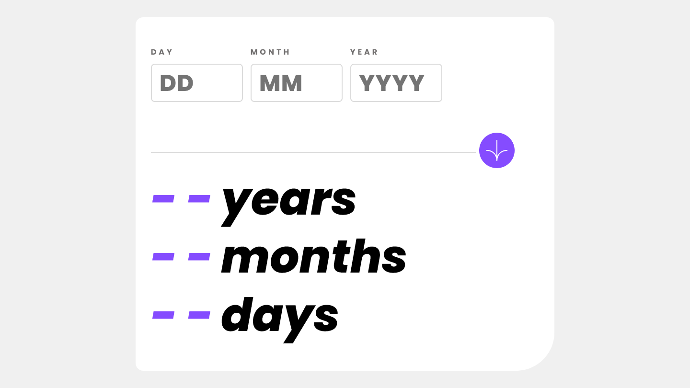
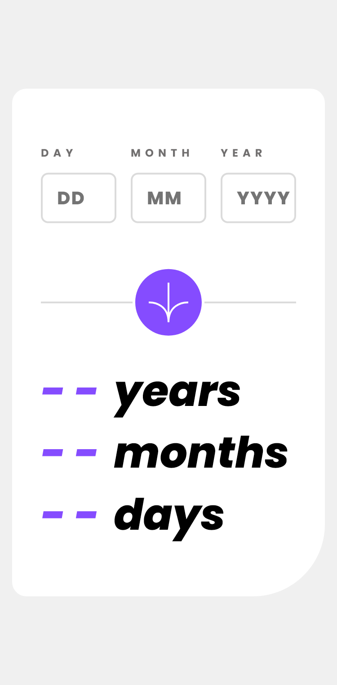

# Frontend Mentor - Age calculator app solution

This is a solution to the [Age calculator app challenge on Frontend Mentor](https://www.frontendmentor.io/challenges/age-calculator-app-dF9DFFpj-Q). Frontend Mentor challenges help you improve your coding skills by building realistic projects.

## Table of contents

- [Overview](#overview)
  - [Screenshot](#screenshot)
  - [Links](#links)
- [My process](#my-process)
  - [Built with](#built-with)
  - [Useful resources](#useful-resources)
- [Author](#author)

## Overview

### Screenshot

Desktop

Movile

### Links

- Solution URL: [GitHub Solution](https://github.com/jordanbichot/ageCalculatorAppAngular.git)
- Live Site URL: [Live Site](https://jordanbichot.github.io/ageCalculatorAppAngular/)

## My process

### Built with

- Semantic HTML5 markup
- CSS custom properties
- Flexbox
- CSS Grid
- Mobile-first workflow
- [Angular](https://angular.io/) - Angular framework
- Angular Reactive Forms

### Useful resources

- [ViewChild](https://angular.io/api/core/ViewChild) - This decorator can be used to access the child component from the parent componenent.

## Author

- Jordan Miguel Bichot Pérez - [FinTech Samurais](https://fintechsamurais.com/)
- Frontend Mentor - [@JordanBichot](https://www.frontendmentor.io/profile/JordanBichot)
- GitHub - [@jordanbichot](https://github.com/jordanbichot)
- LinkedIn - [Jordan Miguel Bichot Pérez](https://www.linkedin.com/in/jordan-miguel-bichot-p%C3%A9rez-613172225)
- Twitter - [@BichotJordan](https://twitter.com/BichotJordan?t=lu5q3WUeYHh3oWaySHXjIg&s=09)
